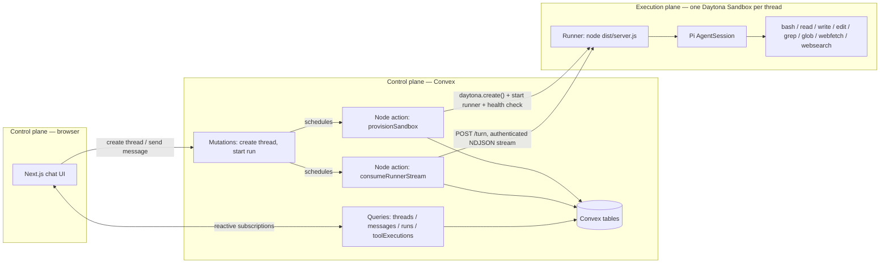

# Pi in a Daytona Sandbox — Agentic Institute Systems Design Assessment

A minimal chatbot where each conversation gets its own **dedicated Daytona sandbox**, with a
[Pi coding-agent](https://github.com/badlogic/pi-mono/blob/main/packages/coding-agent/docs/sdk.md)
session running **inside** that sandbox — not on the application server. [Convex](https://convex.dev)
is the control-plane backend (schema, reactive queries, and the Node actions that talk to Daytona
and to the runner).

> **Terminology note:** the assessment calls for one Daytona "VM" per conversation. Daytona's current
> public API/product surface is the `Sandbox` (an isolated, network-addressable compute unit — creation,
> `Sandbox.process`, `Sandbox.fs`, preview links, etc.). This project treats each Daytona **Sandbox** as
> the required per-thread isolated VM: it is created fresh per thread, runs a single tenant's Pi process,
> and is never shared or reused across conversations. Where "VM" appears below it refers to this sandbox.

## Architecture



**Request flow:**
1. Browser calls `threads.create` (idempotent on `clientRequestId`) → Convex writes a `threads` row
   in state `provisioning` and schedules the `provisionSandbox` Node action.
2. `provisionSandbox` calls `daytona.create()` from the prebuilt `pi-agent-v1` snapshot, injects a
   freshly generated per-thread `RUNNER_TOKEN` plus the model/search secrets as sandbox env vars,
   starts the runner as a background session (`sandbox.process.executeSessionCommand`), polls its
   `/health` endpoint through Daytona's preview link, and on success records the sandbox id and
   provisioning duration, transitioning the thread to `ready`.
3. Browser calls `runs.start` (idempotent on `clientRequestId`, rejected unless the thread is `ready`)
   → inserts the user message, marks the thread `running`, and schedules `consumeRunnerStream`.
4. `consumeRunnerStream` POSTs the prompt to the runner's `/turn` endpoint (authenticated with the
   per-thread `RUNNER_TOKEN`, reached through Daytona's authenticated preview-link URL) and reads back
   an NDJSON stream. Each line is validated against the shared `@agentic/contracts` event schema, then
   turned into Convex writes: incremental assistant-message patches, tool-execution rows, and the
   final run/thread status.
5. The browser never talks to Daytona directly — it only holds a Convex reactive subscription, so
   streamed text and tool activity appear live as Convex mutations land.

## Key design decisions (see `docs/DECISIONS.md` for full ADRs)

| Decision | Why |
|---|---|
| Pi runs **inside** the Daytona sandbox, never on the Convex/Next.js host | The assessment requires actual agent execution inside the isolated environment, not remote tool-calls from outside it. The only `createAgentSession()` call in the repo lives in `sandbox/runner/src/server.ts`, which is baked into the Daytona snapshot image — there is no code path for running Pi on the host. |
| Browser only ever talks to Convex | Keeps Daytona credentials, the per-thread runner token, and model/search provider keys out of the browser entirely. `threads.list`/`threads.get` return a hand-picked safe projection (id/title/state/sandboxId/target/snapshot/provisioningDurationMs) — never the sandbox's `runnerToken`/`previewToken`. |
| Prebuilt `pi-agent-v1` Daytona **snapshot**, not per-thread `npm install` | Installing the runner + Pi dependencies fresh in every sandbox would dominate provisioning time. `scripts/createDaytonaSnapshot.ts` builds the image once (compiles `@agentic/contracts` and the runner to plain JS, `npm install`s `@mariozechner/pi-coding-agent` from the real registry, bakes everything into a Daytona snapshot); per-thread provisioning then only creates a sandbox from that snapshot (~2.4s observed, vs. ~6s+ for the dependency install alone). |
| NDJSON over an authenticated private HTTP endpoint, not a queue/broker | Simplest thing that satisfies "stream partial responses" without adding infrastructure. Daytona's `getPreviewLink(port)` already provides network-level access control (a `DAYTONA_SANDBOX_AUTH_KEY` token); the runner adds its own `Authorization: Bearer <RUNNER_TOKEN>` check on top, so a leaked preview URL alone isn't enough to reach `/turn`. |
| Convex stores event **projections**, not a copy of the sandbox filesystem | The sandbox is the authority for file state; copying it into Convex would be expensive and go stale immediately. Inspecting files is a Pi tool concern (`read`/`grep`/`glob`), not a Convex concern. |
| Exactly one active run per thread | A Pi `AgentSession` is a single ordered conversation; concurrent prompts would make tool/message ordering ambiguous. Enforced twice: Convex's `runs.start` mutation rejects a new run unless the thread is `ready`, and the runner itself returns HTTP 409 if a second `/turn` arrives while one is in flight. |
| Session-name resolution uses `ModelRegistry.find(provider, modelId)`, not `getModel()` | Pi's `getModel()` is generically typed against a compile-time literal model-id union; the runner's provider/model come from runtime env vars, so the dynamic `ModelRegistry.find()` lookup is the correct API for this use case. |

## Tools

All eight required tools are wired into the Pi session with their **exact** required names —
`bash`, `read`, `write`, `edit`, `grep` are Pi's built-ins; `glob`, `webfetch`, `websearch` are custom
`defineTool()` implementations in `sandbox/runner/src/tools/`:

- **glob** — real `glob` npm package. Operates anywhere in the sandbox filesystem (accepts absolute
  or cwd-relative paths), matching read/write/edit/grep's behavior — the sandbox itself, not a
  sub-path within it, is the isolation boundary (ADR-004).
- **webfetch** — http(s)-only, DNS-resolves and rejects private/loopback/link-local addresses
  (`sandbox/runner/src/security/ssrf.ts`), caps redirects (5) and response size (2 MB), retries transient
  network errors and surfaces the real cause instead of a bare `fetch failed` (`sandbox/runner/src/net.ts`).
- **websearch** — real Tavily API call; returns a structured error (never fabricated results) if
  `TAVILY_API_KEY` is missing or the provider is unsupported.

**Two real bugs found and fixed during a rigorous, adversarial audit of all 8 tools** (see
`feature_list.json` for full evidence):
1. Pi's built-in `grep` shells out to `ripgrep` and downloads it at runtime if missing from PATH —
   this failed intermittently in a fresh sandbox. Fixed by baking `ripgrep` into the `pi-agent-v1`
   image via `apt-get` (same no-runtime-install rationale as the snapshot itself, ADR-005).
2. The custom `glob` tool originally rejected any path outside the sandbox's cwd, inconsistent with
   every other tool. Fixed by removing that restriction — verified precise afterward (globbing a
   directory with mixed extensions returned exactly the matching files, none of the others).

> **Known platform limitation (found during live testing, not a code defect):** this Daytona account's
> sandbox network resets HTTPS connections (`ECONNRESET`) to Cloudflare-fronted hosts specifically.
> Confirmed with 7+ live diagnostics across 2 independent fresh sandboxes: `example.com` and
> `api.tavily.com` (both Cloudflare-fronted) consistently fail, while `api.github.com` consistently
> succeeds — ruled out DNS, IPv4-vs-IPv6, and TLS-version as causes. Practical effect: `webfetch` works
> correctly against non-Cloudflare hosts (verified live: `https://api.github.com/zen` → real 200
> response) but currently cannot reach Tavily's API for `websearch` from inside this Daytona account's
> sandboxes. Both tools retry transient errors and report the real underlying cause either way.

One important, non-obvious API detail: `createAgentSession({ tools: [...] })` treats `tools` as an
**allowlist** — passing any value enables *only* those named tools, built-in or custom. An earlier
version of this runner passed `tools: ["read","bash","edit","write","grep"]` (to add `grep` to Pi's
defaults) and this silently disabled all three custom tools. The fix (`tools: [...toolNames]`, reusing
the shared 8-name contract constant) was caught by directly inspecting `session.getAllTools()` against
a real model call, not by type-checking alone.

## Repository layout

```
apps/web/                  Next.js App Router chat UI (ConvexProvider, thread list, composer, tool timeline)
convex/                    Schema, public queries/mutations, internal mutations/queries, Node actions
packages/contracts/        Shared AgentEvent contract + validator + thread lifecycle state machine
sandbox/runner/             In-VM Pi runner: HTTP server, event mapping, the 3 custom tools
scripts/                   createDaytonaSnapshot.ts, benchmarkProvisioning.ts (both real, opt-in, billable)
docs/                       REQUIREMENTS / ARCHITECTURE / DECISIONS / ENVIRONMENT / TESTING / PROGRESS
feature_list.json           Per-feature acceptance criteria + honestly-recorded pass/fail evidence
```

## Setup

### 1. Install and configure Convex

```sh
npm install
npx convex dev   # first run: creates/links a Convex project, writes .env.local
```

Keep this running (it's a dev-mode watcher that syncs `convex/` on save). It writes `CONVEX_URL` to
`.env.local` — for Next.js you also need `NEXT_PUBLIC_CONVEX_URL` (same value, `NEXT_PUBLIC_`-prefixed
vars are the only ones Next.js exposes to the browser) at **both** the repo root and `apps/web/`
(`apps/web/.env.local` is a symlink to the root file, since `next dev` resolves env files relative to
its own working directory, not the monorepo root).

### 2. Push secrets into the Convex deployment (never into the browser)

```sh
npx convex env set DAYTONA_API_KEY <value>
npx convex env set DAYTONA_API_URL https://app.daytona.io/api
npx convex env set DAYTONA_TARGET us
npx convex env set DAYTONA_SNAPSHOT pi-agent-v1
npx convex env set PI_PROVIDER openai
npx convex env set PI_MODEL gpt-4o-mini
npx convex env set OPENAI_API_KEY <value>
npx convex env set WEB_SEARCH_PROVIDER tavily
npx convex env set TAVILY_API_KEY <value>
npx convex env set AGENT_RUNNER_PORT 8787
npx convex env set AGENT_TURN_TIMEOUT_MS 480000
```

### 3. Build the `pi-agent-v1` Daytona snapshot (one-time, billable)

```sh
npm run build --workspace=@agentic/contracts
npm run build --workspace=@agentic/sandbox-runner
DAYTONA_API_KEY=<value> DAYTONA_TARGET=us npm run provision:snapshot
```

### 4. Run

```sh
npm run dev
```

Open `http://localhost:3000`, click **New conversation**, wait for state `ready`, send a message.

## Environment variables

| Variable | Where it's set | Secret | Purpose |
|---|---|---|---|
| `NEXT_PUBLIC_CONVEX_URL` | `.env.local` (root + `apps/web/`, symlinked) | No | Convex deployment URL; only var the browser bundle reads |
| `CONVEX_DEPLOYMENT` | `.env.local` (written by `npx convex dev`) | No | Selects which deployment the Convex CLI targets |
| `DAYTONA_API_KEY` | Convex deployment env (`npx convex env set`) | **Yes** | Authenticates Daytona API calls from `provisionSandbox`/`benchmarkProvisioning` |
| `DAYTONA_API_URL` | Convex deployment env | No | Daytona API base URL (default `https://app.daytona.io/api`) |
| `DAYTONA_TARGET` | Convex deployment env | No | Daytona compute region (`us`) |
| `DAYTONA_SNAPSHOT` | Convex deployment env | No | Name of the prebuilt snapshot (`pi-agent-v1`) every thread provisions from |
| `PI_PROVIDER` | Convex deployment env → forwarded as a sandbox env var | No | `openai` or `anthropic` — selects the LLM provider Pi uses |
| `PI_MODEL` | Convex deployment env → forwarded as a sandbox env var | No | Model id passed to `ModelRegistry.find(provider, modelId)` (e.g. `gpt-4o-mini`) |
| `OPENAI_API_KEY` | Convex deployment env → forwarded as a sandbox env var | **Yes** | Required when `PI_PROVIDER=openai` |
| `ANTHROPIC_API_KEY` | Convex deployment env → forwarded as a sandbox env var | **Yes** | Required when `PI_PROVIDER=anthropic` (unused in the current default config) |
| `WEB_SEARCH_PROVIDER` | Convex deployment env → forwarded as a sandbox env var | No | Only `tavily` is implemented |
| `TAVILY_API_KEY` | Convex deployment env → forwarded as a sandbox env var | **Yes** | Required for the `websearch` tool to return real results |
| `AGENT_RUNNER_PORT` | Convex deployment env → forwarded as a sandbox env var | No | Port the in-sandbox runner HTTP server listens on (default `8787`) |
| `AGENT_TURN_TIMEOUT_MS` | Convex deployment env → forwarded as a sandbox env var | No | Max time a single turn may run before the runner aborts it (default `480000`) |
| `MAX_ACTIVE_THREADS` | Declared in `.env.example` | No | **Not yet enforced** — no code path currently checks or rejects thread creation against this limit |
| `RUNNER_TOKEN` | Generated per-thread at provisioning time, never in any `.env*` file | **Yes** | Random 24-byte token minted fresh per sandbox; authenticates the runner's `/turn`/`/health` endpoints. Stored only in Convex's `sandboxSessions` table (never returned by a public query) |

A root `.env` also exists for convenience during local scripting (e.g. `provision:snapshot`,
`benchmark:provisioning`) — see `.env.example` for its shape. The values that matter at runtime are the
ones pushed into the **Convex deployment environment**, since that's where the Node actions that talk
to Daytona actually execute.

## What's verified vs. what's left

`feature_list.json` is the source of truth: every `passes: true` entry has a dated, specific evidence
string describing exactly what was tested (and by what method — live browser session, direct script
call against the deployment, or code-path reasoning where a live test wasn't run). Every `passes: false`
entry has `evidence: null`.

**Verified end-to-end against a real Daytona account and Convex deployment:** thread creation and its
idempotency (including a true concurrent race, not just sequential duplicate calls), distinct sandbox
provisioning per thread from the shared snapshot, Pi running inside the sandbox (not the host), the
NDJSON streaming bridge, all 8 tools (including a real Tavily `websearch` call), progressive text/tool
streaming into the reactive UI, per-thread secret isolation, single-active-run enforcement, and
**cross-thread VM filesystem isolation** (thread A wrote a unique sentinel file; thread B's sandbox
genuinely could not see it — two independent Daytona sandboxes, not a shared filesystem).

**Provisioning performance** (measured with `npm run benchmark:provisioning`, n=3, real Daytona sandboxes,
target `us`, snapshot `pi-agent-v1`, each cleaned up automatically after measurement):

| Metric | min | median | avg | max |
|---|---|---|---|---|
| Provisioning overhead (sandbox create → runner healthy) | 4171ms | 4202ms | 4265ms | 4423ms |
| Time to first streamed event (health-check-passed → first NDJSON line) | 1550ms | 1777ms | 2115ms | 3018ms |

**A real bug found and fixed during verification:** sandboxes are created `ephemeral: true`, which
Daytona's SDK documents as implicitly setting `autoDeleteInterval: 0` — meaning once a sandbox
auto-stops after `autoStopInterval` (30 min) of inactivity, it is deleted immediately, not just paused.
The original `consumeRunnerStream` action swallowed this into the `runs` row only, leaving the *thread*
silently back in `ready` with a now-dead `sandboxId` reference and no visible error — the composer would
just accept a new message that would then also silently fail. Fixed by transitioning the thread to
`error` with a clear, actionable `lastError` message whenever the runner is unreachable (transport-level
failure), while still letting the thread return to `ready` after an ordinary in-turn failure (a bad LLM
response, a tool error) that doesn't indicate the sandbox itself is gone.

**Not yet done:** stop/resume reconciliation has no UI action yet (an idle-too-long thread currently
needs a brand new conversation, not a "resume" affordance); and there is no automated
Playwright/`test:daytona` suite — all verification above was live/scripted against the real deployment,
not mocked.

## Non-goals (per the assessment)

No authentication, no UI/UX polish beyond a functional minimal shell, no tools beyond the required 8,
no production hardening (rate limiting, multi-region, secret rotation, etc.).

## Demo

See [`docs/DEMO_SCRIPT.md`](docs/DEMO_SCRIPT.md) for the cap.so recording script.
