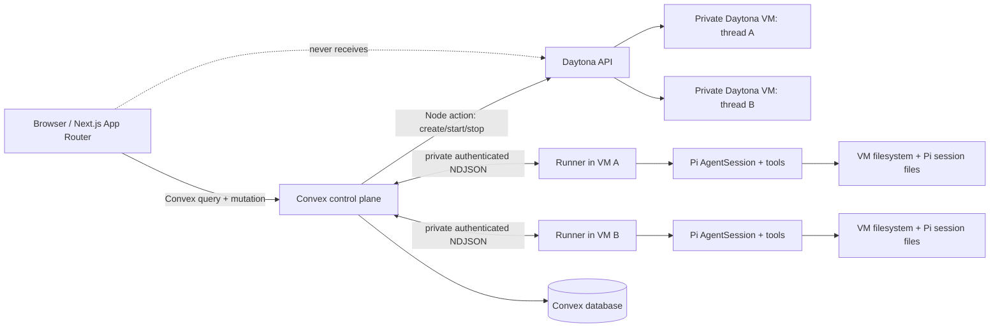

# Architecture

## System boundary

The system has two deliberately separate planes.

- **Control plane:** Next.js browser UI and Convex. Convex is authoritative for UI-facing thread state, message projections, runs, durable tool records, and the thread-to-sandbox mapping.
- **Execution plane:** one private Daytona VM/Sandbox per thread. A TypeScript runner starts inside the VM and embeds Pi through `@mariozechner/pi-coding-agent`'s `createAgentSession`. Pi, its built-in tools, custom tools, session files, and working files stay in that VM.

Pi is not hosted in Next.js or Convex. The Daytona SDK is only used by Convex Node actions to manage the sandbox lifecycle and communicate with the runner. The ready-made `@daytona/pi` integration is not the core solution because it puts the Pi process on the host, which violates the placement requirement.



## Thread-to-VM mapping and lifecycle

`threads` owns the user-visible lifecycle. `sandboxSessions` is a one-to-one record keyed by `threadId`, containing the Daytona sandbox ID, target, snapshot, runner connection metadata excluding secrets, state, and provisioning timings. Creating a thread writes a `provisioning` state and schedules a Node action. The action creates a private sandbox from `DAYTONA_SNAPSHOT`, passes only per-thread secrets to its environment, starts the runner, verifies its health endpoint, then marks the thread `ready`.

The default target is a VM-compatible snapshot such as `daytona-vm-small` when the account supports it. The supplied `.env.example` uses the required logical snapshot name `pi-agent-v1`; `scripts/createDaytonaSnapshot.ts` will later create/validate that named snapshot. A failure to obtain a VM-class sandbox is blocking and must be recorded, not hidden behind a container fallback.

Only one `running` run is permitted per thread. A state transition is enforced by a Convex mutation using an idempotent `clientRequestId`; the mutation creates the run before scheduling the action. This prevents concurrent session prompts and preserves the execution order.

## Runner communication and streaming

The runner exposes a private authenticated endpoint on `AGENT_RUNNER_PORT`. It accepts a normalized turn request and emits NDJSON records for lifecycle changes, text deltas, tool lifecycle/data, and terminal errors. A dynamically minted, per-thread runner token authenticates this channel; it is kept only in runner/provisioning-side secrets and never put in a client-readable Convex document.

Convex consumes the runner stream in a Node action, validates each record against `packages/contracts`, bounds payload sizes, batches durable mutations, and publishes reactive projections. The browser subscribes to Convex queries rather than opening a connection to Daytona. This gives the UI progressive text and tool updates without exposing Daytona preview tokens, runner tokens, Daytona credentials, model keys, or search keys.

```mermaid
sequenceDiagram
  participant U as Browser
  participant X as Convex
  participant D as Daytona API
  participant R as Runner in thread VM
  participant P as Pi AgentSession

  U->>X: createThread(clientRequestId)
  X->>X: insert thread + sandboxSession(provisioning)
  X->>D: create private sandbox from prebuilt snapshot
  D-->>X: sandbox ID
  X->>R: health check with per-thread token
  R-->>X: ready
  X-->>U: reactive thread state = ready
  U->>X: submitMessage(clientRequestId, text)
  X->>X: atomically create run(running) + user message
  X->>R: POST turn
  R->>P: session.prompt(text)
  P-->>R: text delta / tool events
  R-->>X: authenticated NDJSON events
  X->>X: batch persist projections
  X-->>U: reactive partial text + tool records
  P-->>R: terminal event
  R-->>X: run completed or failed
  X-->>U: final state; partial content retained on failure
```

## State ownership

| State | Authoritative owner | Projected to |
| --- | --- | --- |
| Thread metadata, UI states, runs, messages, ordered tool records, sandbox mapping | Convex | Browser through reactive queries |
| Pi session files, runner process memory, VM working filesystem | Daytona VM | Convex receives only normalized event projections |
| Daytona sandbox lifecycle and physical resources | Daytona | Convex stores IDs/states/timings |

Convex deliberately does not mirror the entire VM filesystem. It stores auditable control-plane events; the VM remains the execution-state authority, which avoids large and stale copies of arbitrary workspace data.

## Failure and security boundaries

- Provisioning failures leave the thread in `error` with a typed error and retry path; no runner is assumed ready until health verification succeeds.
- Runner/network failures mark the run failed, retain partial assistant text, and preserve terminal diagnostics.
- Tool errors are structured tool records, not discarded console output.
- The VM is private; the browser never talks directly to it.
- Credentials are server/VM configuration only. Logs redact credentials and cap content sizes.
- `webfetch` validates schemes, limits redirects/time/bytes, applies content-type handling, and blocks private/link-local destinations where practical. `websearch` is a real Tavily adapter when configured, never fabricated output.
- Stop/resume acts on the same sandbox ID so session and filesystem state survive. Deletion is an explicit future lifecycle policy, not a normal turn behavior.

## Important trade-offs

- NDJSON over a private runner endpoint is simpler than introducing a broker or queue, while still carrying progressively persisted events.
- Convex's reactive projections are preferred over direct browser-to-runner streaming for credential and network isolation.
- A prebuilt snapshot increases initial setup work but removes dependency installation from every conversation path.
- A single active run per thread avoids complicated concurrent Pi-session semantics; separate threads still run independently in separate VMs.

